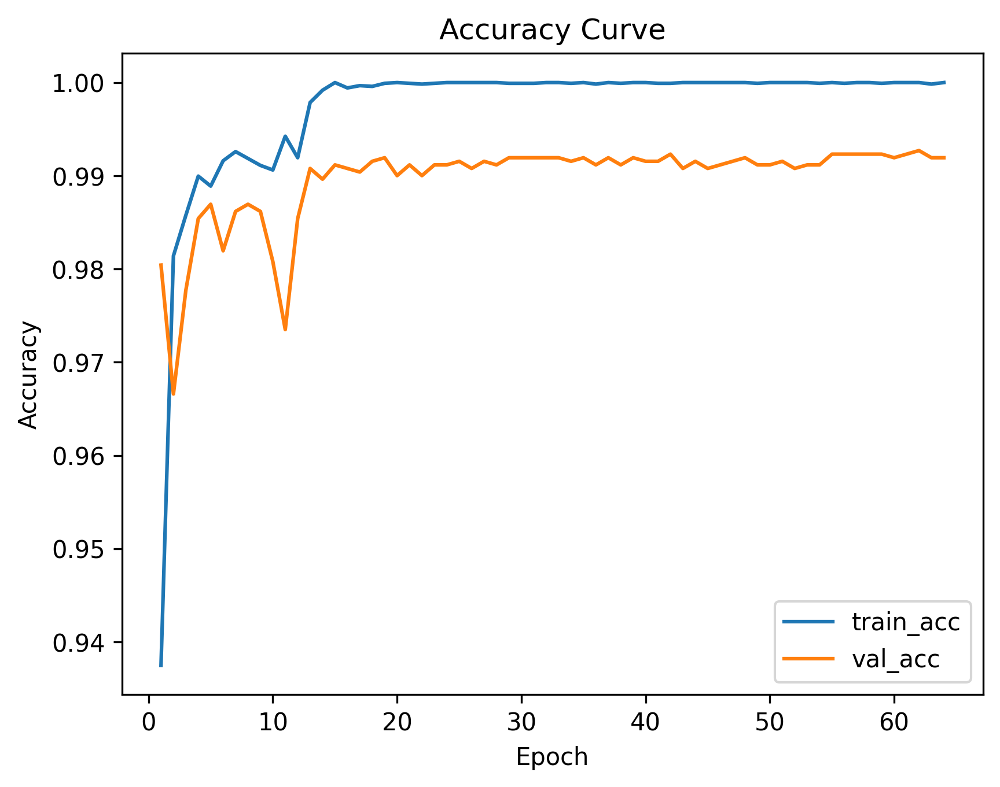
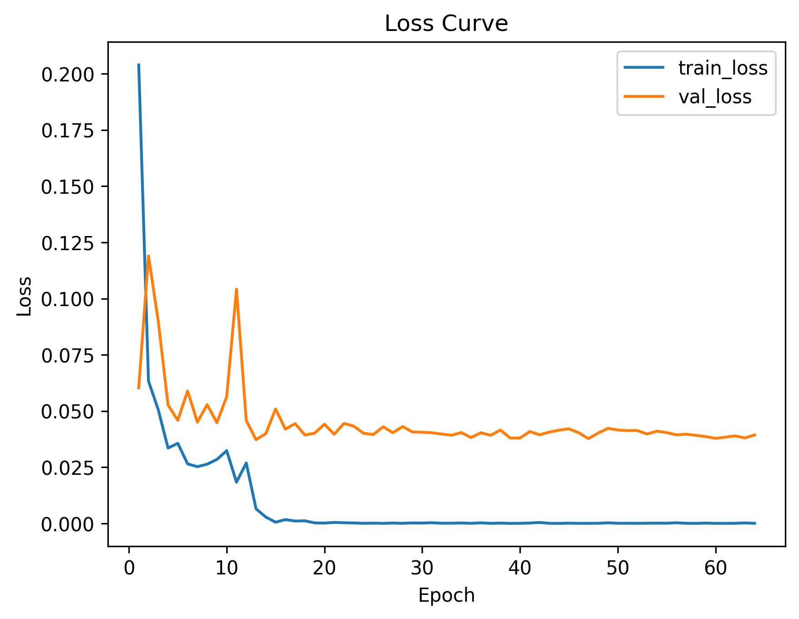
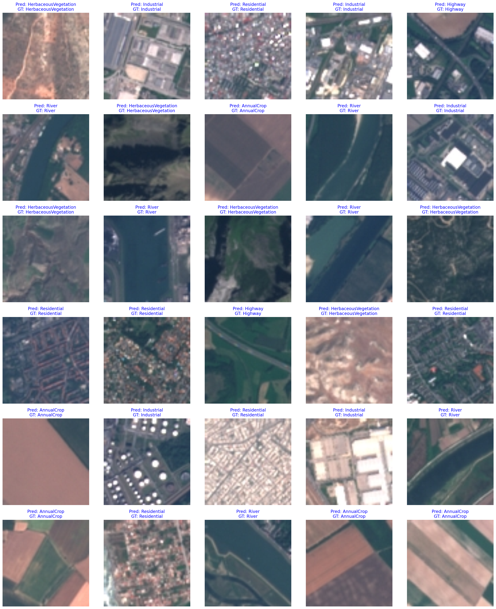

# EuroSAT EfficientNet 專題報告

## 題目
使用 EfficientNet V2 進行 EuroSAT 衛星影像分類

## 專案簡介
本專案使用 PyTorch 與 torchvision 內建的 EfficientNet V2 (s/m/l) 架構，於 EuroSAT 遙測影像資料集上進行分類訓練，評估分類精度並可視化預測結果。

## 動機
衛星影像分類在地理資訊科學、農業監測與土地利用分析等領域均有廣泛應用。本專題希望透過現代化的深度學習方法，有效提升多分類衛星影像辨識的正確率。

## 主要特色
- 採用 EfficientNet V2 (s/m/l) 作為主模型，支援主幹微調/凍結。
- 以 EuroSAT dataset (7:1.5:1.5 訓練:驗證:測試) 分割。
- 訓練過程自動儲存 loss/accuracy 曲線。
- 測試集可自由顯示 N 張預測結果（含正確/錯誤標色）。
- 完整分類報告 (precision, recall, f1-score) 輸出。

## 資料集
- [EuroSAT Dataset (RGB)](https://github.com/phelber/EuroSAT)
- 直接由 `torchvision.datasets.EuroSAT` 下載。

## 執行方式

1. 下載本 repo 到本地或 Colab。
2. 執行 `final.py` 或 `dl3.py`，可調參數如下：
    - `--data_dir` 資料集路徑
    - `--batch_size` 批次大小
    - `--epochs` 訓練次數
    - `--variant` 選擇 efficientnet_v2_s/m/l
    - `--freeze_backbone` 是否凍結主幹

**範例**
```bash
python final.py --variant m --batch_size 64 --epochs 64
```

3. 訓練完成後，會自動輸出：
    - `loss_curve.png`
    - `accuracy_curve.png`
    - 分類結果報告
    - `testset_topN_pred.png`（測試集前 N 張預測圖片）

## 實驗結果展示

- 
- 
- 測試分類報告見 `final.py` 執行輸出。
- 

## 參考文獻

1. P. Helber et al., "EuroSAT: A Novel Dataset and Deep Learning Benchmark for Land Use and Land Cover Classification," IEEE Journal of Selected Topics in Applied Earth Observations and Remote Sensing, 2019.
2. M. Tan, Q. Le, "EfficientNetV2: Smaller Models and Faster Training," ICML 2021.
3. PyTorch / torchvision 官方文件

---
